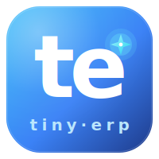

<div align="center">



# tiny-erp

**A modular ERP for tiny businesses — runs entirely on Google Apps Script.**

*ERP gọn nhẹ cho cửa hàng / xưởng nhỏ / cá nhân kinh doanh, chạy 100% trên Google Apps Script.*

[](LICENSE)
[](https://developers.google.com/apps-script)
[](https://core.telegram.org/bots)
[](https://ai.google.dev)
[](CONTRIBUTING.md)
[](#roadmap)

[Quickstart](#quickstart) · [Modules](#modules) · [Documentation](#documentation) · [Architecture](docs/architecture/overview.md) · [Security](SECURITY.md) · [Contribute](CONTRIBUTING.md)

</div>

---

## Table of contents

- [Why tiny-erp](#why-tiny-erp)
- [Modules](#modules)
- [Tech stack](#tech-stack)
- [Quickstart](#quickstart)
- [Slash commands](#slash-commands)
- [Architecture](#architecture)
- [Documentation](#documentation)
- [Customization](#customization)
- [Self-tests](#self-tests)
- [Roadmap](#roadmap)
- [Contributing](#contributing)
- [Security](#security)
- [Localization](#localization)
- [License](#license)
- [Acknowledgements](#acknowledgements)

## Why tiny-erp

Small businesses (workshops, print shops, repair stores, single-person traders) usually:

- Retype every quote / order by hand — costs hours per week
- Can't afford commercial ERPs (SAP B1, Misa, Bravo) — $50–500/mo minimum
- Don't have IT staff to host or maintain a server
- Already have Gmail · Sheets · Drive — they just need automation glue

**tiny-erp** stitches them together: chat with a Telegram bot → AI extracts entities → Google Sheet template fills automatically → PDF lands back in your chat. Zero servers, zero monthly cost (beyond pennies of Gemini tokens).

> Originally built for a Vietnamese wood workshop. Refactored into a generic modular framework — báo giá is just one module.

## Modules

| Module | Status | What it does | Commands |
|---|---|---|---|
| [`quotes`](src/modules/quotes/) | MVP | AI extracts quote → fills Sheet → exports PDF | `/baogia`, free text |
| [`settlements`](src/modules/settlements/) | template only | Reconcile quoted vs actual + advance payments | (manual fill) |
| [`crm`](src/modules/crm/) | skeleton | Customer registry | `/khach add\|find\|list` |
| [`catalog`](src/modules/catalog/) | skeleton | Product / service catalog | `/sp add\|find\|list` |
| `orders` | roadmap | Convert quote → order, status tracking | — |
| `invoices` | roadmap | Generate invoices from orders | — |
| `payments` | roadmap | Advance + receivables tracking | — |
| `reports` | roadmap | AI-summarized monthly / quarterly | — |

Each module is a plug-in registered with a central `Router`. See [architecture overview](docs/architecture/overview.md) for the layering and the [adding-a-module guide](docs/guides/adding-a-module.md) for how to build your own.

## Tech stack

| Layer | Choice | Why |
|---|---|---|
| Runtime | **Google Apps Script** (V8) | $0, no server, OAuth handled |
| Storage | **Google Sheets + Drive** | $0, schema visible, owner-readable |
| Chat UI | **Telegram Bot API** | Zero requirements, inline keyboards, PDF blob upload |
| AI | **Gemini 2.5 Flash** | Cheapest multimodal tier (text + image input) |
| Deploy | **[clasp](https://github.com/google/clasp)** | Single `push`, no build step |
| Language | Plain JavaScript | Apps Script V8 — no TypeScript, no bundler |

Zero open-source dependencies at runtime. Everything is free-tier or pennies-per-call. Rationale behind each choice lives in the [ADR log](docs/adr/).

## Quickstart

> Read [SECURITY.md](SECURITY.md) first — the webhook is internet-reachable. Set `TELEGRAM_WEBHOOK_SECRET` and `TELEGRAM_ALLOWED_USER_IDS` before exposing it.

A more detailed walkthrough (with screenshots and troubleshooting) lives in [docs/guides/quickstart.md](docs/guides/quickstart.md). The short version:

### Prerequisites

- Google account (no Workspace required)
- [Telegram](https://telegram.org) (for [@BotFather](https://t.me/BotFather))
- [Gemini API key](https://ai.google.dev) (free tier OK for testing)
- [Node.js](https://nodejs.org) (for clasp CLI)

### 1. Clone and push to Apps Script

```bash
git clone https://github.com/<you>/tiny-erp
cd tiny-erp
npm i -g @google/clasp
clasp login
clasp create --type standalone --title "tiny-erp" --rootDir ./src
clasp push
```

### 2. Configure Script Properties

Apps Script editor → Project Settings → Script Properties. Required minimum:

| Key | Value |
|---|---|
| `GEMINI_API_KEY` | from [ai.google.dev](https://ai.google.dev) |
| `TELEGRAM_BOT_TOKEN` | from [@BotFather](https://t.me/BotFather) |
| `TELEGRAM_ALLOWED_USER_IDS` | your user IDs (comma-separated). Find via [@userinfobot](https://t.me/userinfobot) |

Full surface: see [`.env.example`](.env.example).

### 3. Initialize from the editor

Run each function once from Apps Script editor (Run button):

```js
setup_generateWebhookSecret()  // random ?token=... for webhook auth
setup_createTemplate()         // creates BaoGia + QuyetToan Sheet templates
setup_createDatabase()         // creates ERP DB Sheet (CRM / catalog tabs)
```

### 4. Deploy as Web App and register webhook

Apps Script editor → Deploy → New deployment → Web app:

- **Execute as**: *Me*
- **Who has access**: *Anyone* (auth happens via webhook secret, not Google ACL)

Copy the `…/exec` URL, then in editor:

```js
setup_telegramWebhook()  // auto-attaches secret token to URL
```

### 5. Try it

Open Telegram → find your bot → `/start`. Then a real quote:

```
Báo giá cho anh Tuấn: 5 cửa gỗ sồi 90x220 đơn giá 4tr5,
1 tủ áo 3m2 gỗ công nghiệp giá 3tr2/m2
```

You'll get a summary plus 3 buttons — tap **OK – Xuất PDF** to receive the rendered file.

Try other modules:

```
/khach add Nguyễn Văn A | 0901234567 | 123 Hai Bà Trưng | VIP
/sp add CUA-SOI-90 | Cửa gỗ sồi 90x220 | cái | 4500000 | Cửa
/sp list
```

## Slash commands

| Command | Module | Description |
|---|---|---|
| `/start`, `/help` | quotes | Welcome + usage |
| `/baogia <text>` *(or just free text)* | quotes | Start a new quote |
| `/huy`, `/cancel` | quotes | Cancel current session |
| `/reset` | quotes | Force-reset session (recover from stuck state) |
| `/khach add\|find\|list` | crm | Customer CRUD |
| `/sp add\|find\|list` | catalog | Product / service CRUD |

Each module is free to register its own — see [`QuoteCommands.register()`](src/modules/quotes/QuoteCommands.js) for the pattern.

## Architecture

```
Telegram update → TelegramHandler → Router → Module Commands → AI · Sheet · PDF · DB
                    (adapter)       (core)      (modules)         (adapters)
```

```
src/
├── Code.js · Setup.js · Selftest.js       # entry + admin
├── core/        Config · Logger · Router · StateManager · DB
├── adapters/    TelegramAPI · TelegramHandler · AIClient · PDFExporter
├── modules/     quotes · settlements · crm · catalog
└── legacy/      zalo (deprecated reference)
```

**Layer rules** (enforced by convention, since Apps Script has one flat namespace):

- `modules/` may call `core/` and `adapters/`
- `adapters/` may call `core/` only
- `core/` is self-contained

Full design and trade-offs: [docs/architecture/overview.md](docs/architecture/overview.md).

## Documentation

All long-form documentation lives in [`docs/`](docs/):

| Section | Purpose |
|---|---|
| [`docs/architecture/overview.md`](docs/architecture/overview.md) | System layering, folder map, data flow |
| [`docs/adr/`](docs/adr/) | Architecture Decision Records — *why* each major choice was made |
| [`docs/guides/quickstart.md`](docs/guides/quickstart.md) | End-to-end setup walkthrough (~20 min from clone to first PDF) |
| [`docs/guides/adding-a-module.md`](docs/guides/adding-a-module.md) | Build your own ERP module (`orders` walkthrough, ~80 LOC) |
| [`CONTRIBUTING.md`](CONTRIBUTING.md) | Code style, module conventions, PR checklist |
| [`SECURITY.md`](SECURITY.md) | Threat model + disclosure policy |

Start with the [architecture overview](docs/architecture/overview.md) if you're reading the codebase, or the [quickstart guide](docs/guides/quickstart.md) if you just want it running.

## Customization

| To change | Edit |
|---|---|
| Company name / address on the quote header | [`QuoteTemplate.js`](src/modules/quotes/QuoteTemplate.js) row 1–2 — or just edit the Sheet after `setup_createTemplate` |
| Quote layout (columns, max items) | [`QuoteLayout.js`](src/modules/quotes/QuoteLayout.js) + [`QuoteTemplate.js`](src/modules/quotes/QuoteTemplate.js) |
| VAT rate | Script Property `VAT_RATE` (default `0.08`) |
| AI prompt | [`QuoteExtractor.js`](src/modules/quotes/QuoteExtractor.js) → `SYSTEM_PROMPT` |
| Welcome message | [`QuoteCommands.js`](src/modules/quotes/QuoteCommands.js) → `_help` |
| Bot's tone of voice | Translate / tune the strings in `*Commands.js` files |
| Add a new module | See [docs/guides/adding-a-module.md](docs/guides/adding-a-module.md) — `Order` module walkthrough |

## Self-tests

Run from Apps Script editor to verify each layer in isolation:

```js
selftest_config            // Properties loaded?
selftest_pipeline          // text → AI → Sheet → totals (E2E, no Telegram)
selftest_pdfExport         // Drive scope granted?
selftest_db                // CRM insert / query works
selftest_routerCommands    // list registered slash commands
selftest_listGeminiModels  // discover model names your API key can access
```

## Roadmap

- [x] Quote module MVP (AI extract → Sheet → PDF)
- [x] Telegram integration (inline keyboard, PDF blob upload)
- [x] Security hardening (webhook secret, allowlist, sanitized logs)
- [x] Modular ERP framework (Router, DB, plug-in modules)
- [x] Architecture Decision Records ([docs/adr/](docs/adr/))
- [ ] `orders` module — quote → order conversion with status
- [ ] `invoices` module — generate from orders, email delivery
- [ ] `payments` module — advances + receivables
- [ ] `reports` module — `/baocao thang|quy|nam` with AI summary
- [ ] `crm ↔ quotes` cross-link — auto-suggest customer when name matches
- [ ] Adapter: Facebook Messenger
- [ ] Adapter: revive Zalo when business registration verified

## Contributing

Contributions welcome — especially **new modules**. Adding a module is ~50–80 lines of code following the [Order module walkthrough](docs/guides/adding-a-module.md).

Good first issues:

- Translate user-facing strings to English (currently Vietnamese-first)
- Add an `orders` module skeleton
- Add inline-keyboard pagination to `/khach list`
- Write a `messenger` adapter

By submitting code, you agree to license it under the [MIT License](LICENSE). See [CONTRIBUTING.md](CONTRIBUTING.md) for code style and PR conventions.

## Security

The webhook endpoint is internet-reachable. Before deploying publicly, read [SECURITY.md](SECURITY.md) and configure:

- `TELEGRAM_WEBHOOK_SECRET` — `setup_generateWebhookSecret()`
- `TELEGRAM_ALLOWED_USER_IDS` — your Telegram user ID(s)

Vulnerabilities: please disclose via the contact in [SECURITY.md](SECURITY.md), not GitHub Issues.

## Localization

Bot replies and AI prompts are Vietnamese by default — the original audience is Vietnamese SMBs. To localize:

1. Edit strings in `*Commands.js` files (one file per module)
2. Edit `SYSTEM_PROMPT` in `*Extractor.js` (currently Vietnamese instructions)
3. Edit `QuoteTemplate.js` / `SettlementTemplate.js` for sheet headers

A proper i18n layer is on the roadmap. PRs welcome.

## License

[MIT](LICENSE) © 2026 tiny-erp contributors.

## Acknowledgements

- [Google Apps Script](https://developers.google.com/apps-script) — the unsung backbone of countless SMB automations
- [Telegram Bot Platform](https://core.telegram.org/bots) — free, no-friction chat infrastructure
- [Gemini API](https://ai.google.dev) — multimodal extraction at SMB-affordable price
- The original wood workshop owner who agreed to be the alpha user
